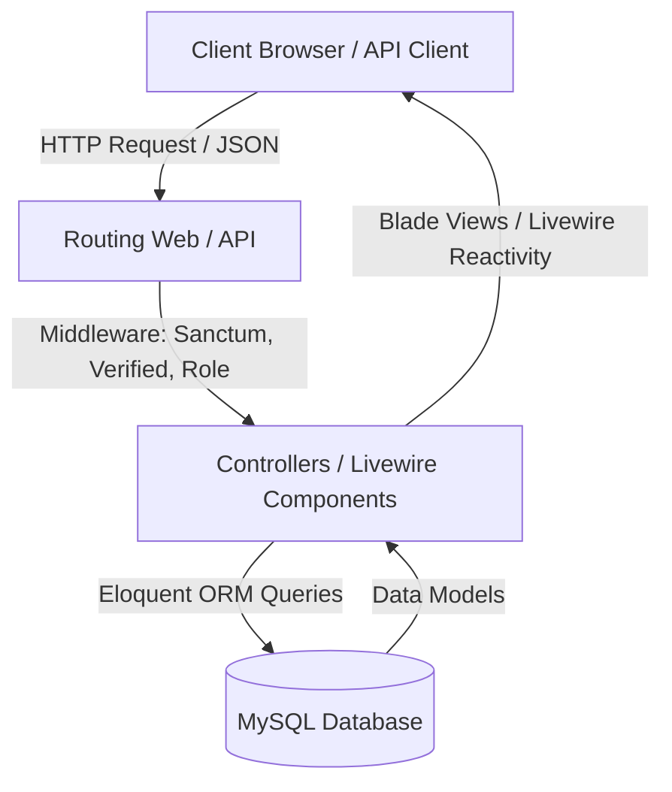
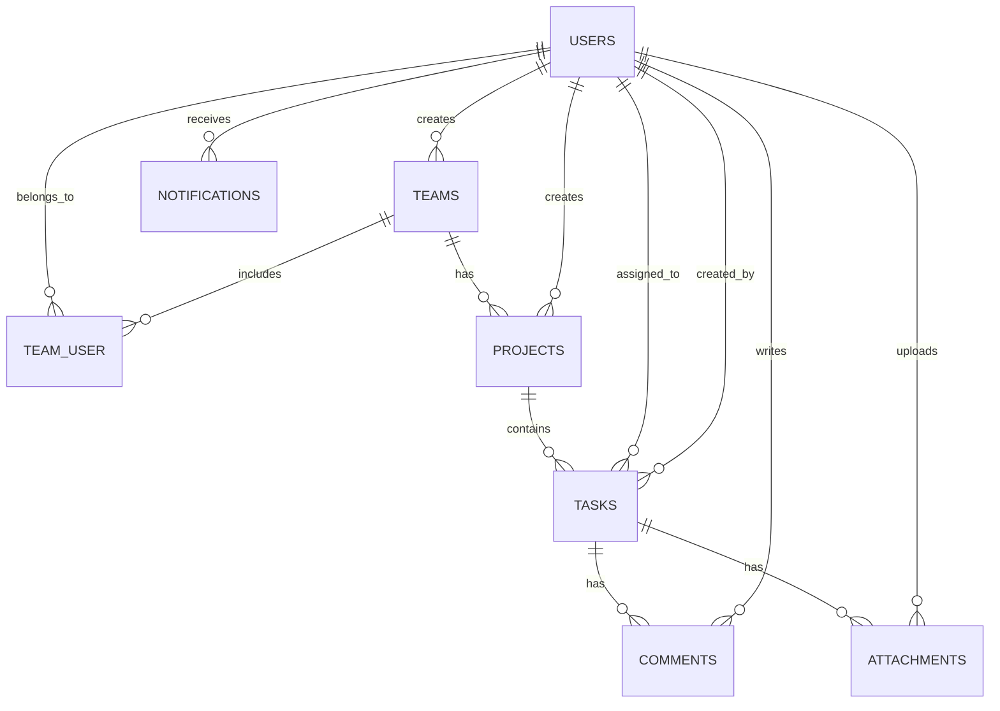

# Project Report: TaskFlow Collaborative Task Management System

---

## 1. Introduction
Modern software engineering and project management depend heavily on seamless collaboration, clear delegation, and highly organized workflows. **TaskFlow** is a modern, premium, web-based collaborative task management system designed to streamline productivity for teams, managers, and system administrators. 

Unlike traditional, cluttered task trackers, TaskFlow focuses on clean visual aesthetics, real-time collaboration tools, and structured progress tracking. By offering granular controls over teams, projects, tasks, and task attachments, the system ensures that team members can collaborate effectively while managers can derive valuable insights from automated progress reports. Built with safety and high performance at its core, the application integrates multi-layered user authentication, secure file management, and a robust RESTful API system for cross-platform utility.

---

## 2. Project Objectives
The main objective of TaskFlow is to deliver an enterprise-ready, collaborative workspace that simplifies project tracking. Specifically, the system aims to:
*   **Establish Granular Team Hierarchy:** Allow users to create teams and associate them with specific projects, mirroring real-world organizational layouts.
*   **Facilitate Task Lifecycle Management:** Track task progress from inception through transition phases to completion, with dedicated properties for priority and deadline management.
*   **Enhance Real-Time Feedback and Communication:** Empower users to comment on specific tasks and upload documents directly.
*   **Provide Secure Multi-Channel Authentication:** Secure web routes via OAuth (Google Sign-In) and session-based authentication, and guard REST APIs via state-of-the-art token security.
*   **Implement Role-Based Authorization:** Restrict access to sensitive areas (e.g., resource allocation and performance reports) based on pre-defined roles like Administrator, Manager, and Team Member.
*   **Ensure Fast Resource Queries:** Optimize database tables using indexes to prevent latency under large datasets.

---

## 3. Technologies Used
TaskFlow is developed using a robust, state-of-the-art technology stack that provides high availability, scalability, and premium styling:

*   **Backend Framework:** **Laravel 12** — The latest iteration of the enterprise PHP framework, providing elegant ORM, robust routing, and native support for modern features.
*   **Authentication Suite:**
    *   **Laravel Jetstream:** Provides a solid, session-based authentication foundation with profile and team management.
    *   **Laravel Socialite:** Enables secure, seamless third-party authentication via Google OAuth.
    *   **Laravel Sanctum:** Provides lightweight API token management for mobile or external clients.
*   **Frontend UI and Styling:** **Tailwind CSS** & **Livewire** — Tailwind CSS provides highly optimized, rich, and responsive designs. Livewire facilitates dynamic, real-time reactive UI components (e.g., notification bells and task cards) without writing extensive JavaScript.
*   **Database Engine:** **MySQL** — Reliable, structured relational storage with optimized indexing for quick lookups.
*   **API Verification:** **Postman** — Utilized to mock, test, and document the Sanctum RESTful API lifecycle.
*   **Deployment and Hosting:** **AWS (Amazon Web Services) EC2** — Secure web servers for production staging.
*   **Version Control:** **GitHub** — Facilitates seamless collaborative staging, feature branches, and code reviews.

---

## 4. System Architecture
The TaskFlow application follows the classic Model-View-Controller (MVC) architecture, reinforced with modern reactive layers (Livewire) and custom Middleware filters.



The system operates across three primary layers:
1.  **Presentation Layer:** Consists of responsive Blade templates styled with Tailwind CSS, utilizing Livewire components (`TaskList.php`, `CommentSection.php`, `NotificationBell.php`) for dynamic browser interactions.
2.  **Logic & Authorization Layer:** Manages incoming traffic using Laravel HTTP routes, validating sessions and API tokens. Custom middleware layers (such as `RoleMiddleware.php`) regulate controller access.
3.  **Data Layer:** Utilizes Eloquent ORM mapping to coordinate transactions with the underlying MySQL database.

---

## 5. Database Design
The relational database design ensures high data integrity and referential safety through foreign key cascading, and optimizes performance using indexes.

### Entity-Relationship Diagram (ERD)



[Insert Screenshot: Database Tables]

### Schema Table Definitions

#### `users` Table
Stores account profiles, authentication data, roles, and Google OAuth credentials.
*   `id` (BigInt, Primary Key, Auto-increment)
*   `name` (String, Required)
*   `email` (String, Unique, Required)
*   `password` (String, Hashed, Required)
*   `role` (Enum: `admin`, `manager`, `user`, Default: `user`)
*   `google_id` (String, Nullable, Indexed)
*   `avatar` (Text, Nullable)

#### `teams` Table
Manages organization groupings.
*   `id` (BigInt, Primary Key)
*   `team_name` (String, Required)
*   `created_by` (Foreign Key -> `users.id`, Cascade on delete)

#### `team_user` Pivot Table
Resolves many-to-many relationships between users and teams.
*   `team_id` (Foreign Key -> `teams.id`)
*   `user_id` (Foreign Key -> `users.id`)
*   *Unique index combined on `[team_id, user_id]`*

#### `projects` Table
*   `id` (BigInt, Primary Key)
*   `project_name` (String)
*   `description` (Text, Nullable)
*   `start_date` (Date, Nullable)
*   `end_date` (Date, Nullable)
*   `team_id` (Foreign Key -> `teams.id`, Cascade)
*   `created_by` (Foreign Key -> `users.id`, Cascade)

#### `tasks` Table
*   `id` (BigInt, Primary Key)
*   `task_name` (String)
*   `description` (Text, Nullable)
*   `priority` (String: `low`, `medium`, `high`, Default: `medium`)
*   `deadline` (Date, Nullable)
*   `status` (String: `pending`, `in_progress`, `completed`, Default: `pending`)
*   `task_type` (String, Nullable)
*   `project_id` (Foreign Key -> `projects.id`, Cascade, Nullable)
*   `assigned_to` (Foreign Key -> `users.id`, Set Null, Nullable)
*   `created_by` (Foreign Key -> `users.id`, Cascade)

---

## 6. Laravel 12 Implementation
TaskFlow leverages **Laravel 12**'s modern enhancements. Feature implementations follow clean, secure paradigms:

### File Management and Storage
The attachment feature utilizes Laravel's secure filesystem disk storage configuration. Users can securely upload task deliverables, which are kept outside the public root. Downloading is controlled via a custom method that ensures only authorized users can trigger download actions:
```php
public function downloadAttachment($id)
{
    $attachment = Attachment::findOrFail($id);
    
    // Authorize that the user is part of the project/task team
    $this->authorize('view', $attachment->task);

    return Storage::download($attachment->file_path, $attachment->file_name);
}
```

### Livewire Reactivity
Interactive states, such as posting comments and reading notifications, are implemented using Livewire, eliminating page refreshes and improving the user experience.

---

## 7. Authentication System
TaskFlow provides two separate web authentication strategies to maximize flexibility:

### 1. Jetstream Session Authentication
Standard user registration, login, profile updates, password changes, and optional two-factor authentication are handled by Jetstream.

[Insert Screenshot: Login Page]

### 2. Socialite Google OAuth Integration
Users can seamlessly sign in or register with their existing Google accounts. The integration resides in a streamlined `GoogleController.php` (with a stateless OAuth request mapped cleanly to standard application settings):

```php
public function handleGoogleCallback()
{
    $googleUser = Socialite::driver('google')->user();

    $user = User::where('email', $googleUser->email)->first();

    if (!$user) {
        $user = User::create([
            'name' => $googleUser->name,
            'email' => $googleUser->email,
            'google_id' => $googleUser->id,
            'avatar' => $googleUser->avatar,
            'password' => bcrypt(Str::random(24))
        ]);
    }

    Auth::login($user);

    return redirect('/dashboard');
}
```

---

## 8. Laravel Sanctum API Authentication
External entities, mobile applications, and testing tools authenticate with the RESTful API via **Laravel Sanctum**.

### Sanctum Token Issuance Flow
1.  The client issues a `POST` request to `/api/v1/login` with their `email` and `password`.
2.  The application verifies the credentials against the hashed database records.
3.  Upon matching, an API token is generated (`$user->createToken('auth_token')->plainTextToken`) and returned inside a JSON package.
4.  Subsequent requests include this token in the header as:
    `Authorization: Bearer <token_string>`
5.  Logging out deletes the token record (`$request->user()->currentAccessToken()->delete()`).

```php
// Sanctum API routes in routes/api.php
Route::middleware('auth:sanctum')->group(function () {
    Route::post('/logout', [ApiAuthController::class, 'logout']);
    Route::get('/tasks', [ApiTaskController::class, 'index']);
});
```

[Insert Screenshot: API Authentication]

---

## 9. Security Documentation
TaskFlow integrates multiple layers of protection to satisfy modern security compliance:

1.  **CSRF (Cross-Site Request Forgery) Protection:** Standard Laravel web middleware injects security tokens to prevent unauthorized form submissions.
2.  **Secure Password Hashing:** Uses `bcrypt` (with standard salt strength) for storing passwords.
3.  **Cross-Site Scripting (XSS) Mitigation:** Blade automatically escapes rendering strings, keeping inputs harmless.
4.  **Prepared SQL Queries:** Eloquent ORM uses PDO parameter binding automatically, preventing SQL injection vulnerabilities.
5.  **Role-Based Access Control (RBAC):** Custom `RoleMiddleware.php` ensures that users cannot access routes that exceed their role limits.
6.  **Performance Database Indexes:** Multi-column indexes prevent denial-of-service (DoS) performance degradation:
    ```php
    Schema::table('tasks', function (Blueprint $table) {
        $table->index(['project_id', 'status']);
        $table->index('assigned_to');
    });
    ```

[Insert Screenshot: Security Implementation Files]

---

## 10. CRUD Functionalities
Core business features are fully accessible through CRUD controllers in both web and API systems.

### Tasks CRUD
*   **Create:** Managers and users assign tasks with names, descriptions, priorities, and deadlines.
*   **Read:** Displays user-assigned tasks, team-shared tasks, or project backlogs.
*   **Update:** Tasks can be updated or marked as `completed` using standard resource operations.
*   **Delete:** Tasks can be deleted by their creator or a team manager.

[Insert Screenshot: Task Creation]

### Projects CRUD
*   Governed by `ProjectController.php`, projects are associated with a specific team.
*   **Create:** A manager creates a project to organize task backlogs.
*   **Read / Edit:** Restricts access to team members using custom policy definitions (`ProjectPolicy.php`).

[Insert Screenshot: Team/Project Pages]

### Teams, Comments & Notifications
*   **Teams:** Pivoted dynamic relationships (`team_user`) handle memberships.
*   **Comments:** Users exchange feedback directly on task view cards.
*   **Notifications:** Event-driven updates notify users about new task assignments.

[Insert Screenshot: CRUD Operations]

---

## 11. API Development and Integrations
TaskFlow features a complete API module under the `v1` namespace.

### Core Endpoints

| Endpoint | Method | Middleware | Description |
| :--- | :--- | :--- | :--- |
| `/api/v1/register` | `POST` | *None* | Registers a new user and returns a Sanctum access token. |
| `/api/v1/login` | `POST` | *None* | Authenticates credentials and returns a token. |
| `/api/v1/tasks` | `GET`/`POST` | `auth:sanctum` | Lists or creates tasks. |
| `/api/v1/projects` | `GET`/`POST` | `auth:sanctum`, `role:manager,admin` | REST resources for managers. |

[Insert Screenshot: API Routes and Postman Testing]

---

## 12. AWS Deployment
TaskFlow is hosted on an **AWS EC2 (Elastic Compute Cloud)** virtual machine instance, running a secure production environment.

### Deployment Walkthrough
1.  An Ubuntu Linux instance was launched on AWS EC2, and security groups were configured to allow traffic on ports 80 (HTTP), 443 (HTTPS), and 22 (SSH).
2.  Installed Apache/Nginx, PHP 8.2+, and MySQL server.
3.  Cloned the repository, ran `composer install --no-dev --optimize-autoloader`, and updated the `.env` settings to target the production database.
4.  Configured directories and permissions for the storage folder using `chown` and `chmod`.
5.  Ran database migrations and seeders (`php artisan migrate --force`).

[Insert Screenshot: AWS Deployment]

---

## 13. GitHub Integration
The project's codebase is managed under **GitHub** version control.

### Branch and Collaboration Workflow
*   **`main` Branch:** Represents the stable, deployable production build.
*   **Feature Branches:** Developers work on separate branches (e.g., `feature/socialite-login`, `feature/sanctum-apis`) before merging.
*   **Pull Requests (PRs):** Peer reviews and static analysis checks are completed on GitHub before merging code into the main branch.

[Insert Screenshot: GitHub Repository]

---

## 14. Testing
Extensive automated and manual validation processes ensure the application is reliable and bug-free:

1.  **Unit & Feature Testing:** PHPUnit checks user sign-ups, authorization middleware, resource deletion restrictions, and OAuth routing.
2.  **API Verification via Postman:**
    *   Auth requests are submitted to `/api/v1/login`.
    *   The received token is stored as a variable and passed in subsequent headers.
    *   Requests are sent to protected `/tasks` routes to verify security.
3.  **UI & UX Manual Walkthroughs:** Validated form inputs, responsive layouts on mobile screen sizes, and dynamic Livewire actions under various user roles.

---

## 15. Challenges and Solutions

### Challenge 1: Name Conflicts and Duplicate Classes in Routing
*   **Problem:** Duplicate OAuth controllers (`App\Http\Controllers\GoogleController` and `App\Http\Controllers\Auth\GoogleController`) caused name collisions and broke route execution during class compilation.
*   **Solution:** Removed the redundant auth subfolder controller and updated `routes/web.php` to target the main, stable `GoogleController`. Re-optimized autoload using `composer dump-autoload` to clean up the namespaces.

### Challenge 2: Role Authorization across Web & API
*   **Problem:** Unifying role check logic across session-based web views and token-based Sanctum API requests.
*   **Solution:** Created a unified `RoleMiddleware.php` check that inspects the authenticated `$request->user()->role` dynamically, verifying role authorization across both channels.

---

## 16. Conclusion
The **TaskFlow Collaborative Task Management System** is a robust, responsive, and secure project coordination solution. Built with **Laravel 12**, it combines structured project management features with real-time elements, reliable OAuth integrations, and a secure REST API. By addressing real-world operational challenges through structured databases and secure API tokens, the application serves as a reliable solution for team collaboration.

---

## 17. References
1.  *Laravel 12 Documentation:* Official framework guidelines, routing models, and Sanctum documentation. (https://laravel.com)
2.  *Laravel Socialite Documentation:* Google OAuth integration strategies. (https://laravel.com/docs/socialite)
3.  *Tailwind CSS Documentation:* Designing premium component utility rules. (https://tailwindcss.com)
4.  *MySQL Manual:* In-depth indexing strategies and foreign key cascading.

---

## 18. Appendices

### Directory Structure Overview
```text
taskflow/
├── app/
│   ├── Http/
│   │   ├── Controllers/
│   │   │   ├── Api/            <-- Sanctum REST Endpoints
│   │   │   └── GoogleController.php
│   │   └── Middleware/
│   │       └── RoleMiddleware.php
│   └── Livewire/               <-- Reactive UI Components
├── database/
│   └── migrations/             <-- Database Schema Migrations
├── resources/
│   └── views/                  <-- Tailwind Blade Views
└── routes/
    ├── api.php                 <-- Sanctum Auth API Routes
    └── web.php                 <-- Session Auth Web Routes
```
